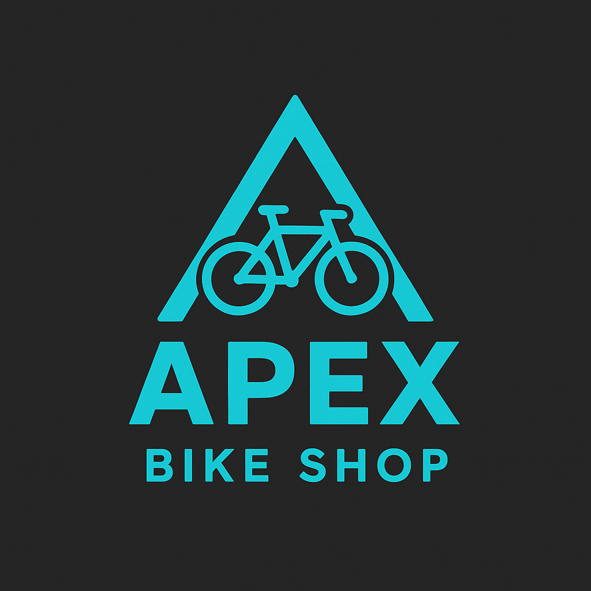
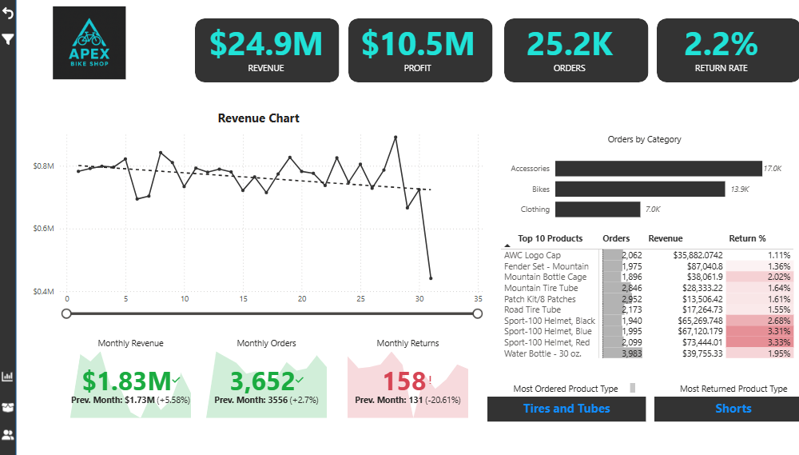
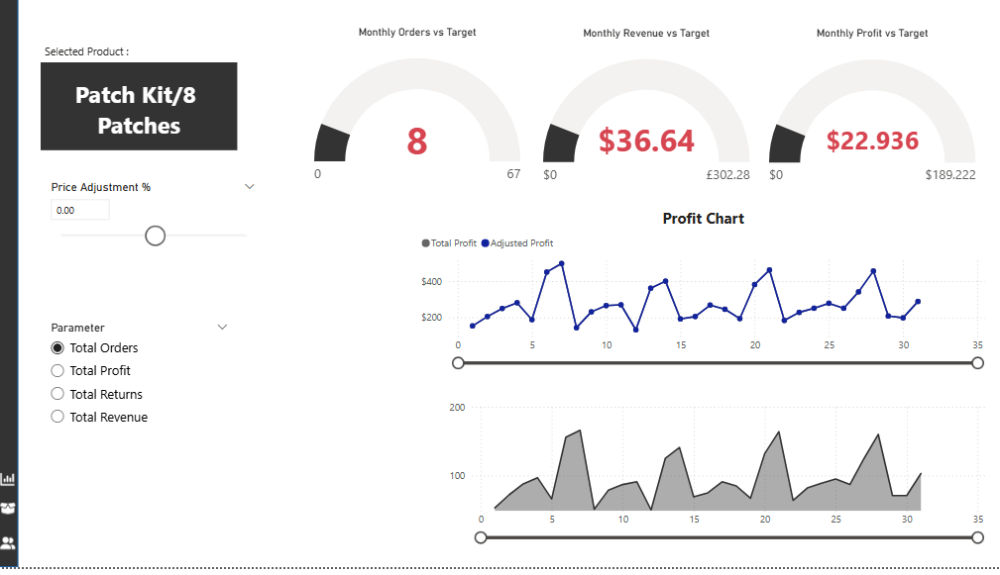
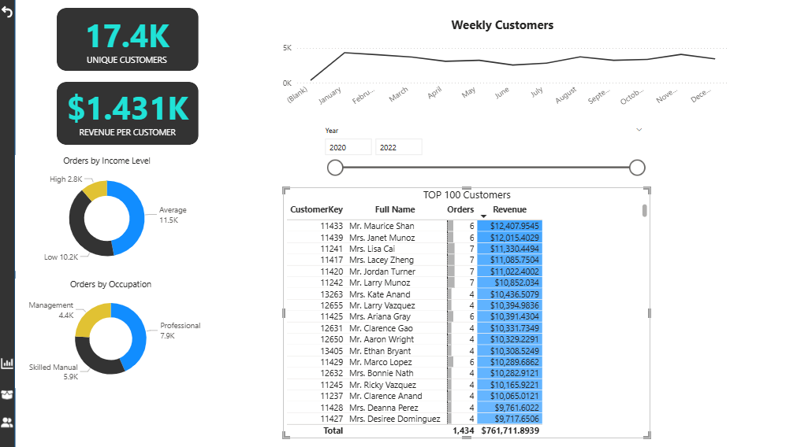

# 🚲 Apex Bike Shop - Power BI Dashboard

## 📊 Overview
This Power BI dashboard provides a comprehensive analysis of a bike shop’s sales, customers, and product performance.  
It highlights key insights into revenue trends, top-selling products, customer demographics, and inventory overview, helping to make data-driven business decisions.

## ✨ Features
- Sales performance analysis (monthly & yearly trends)  
- Top-selling products and categories  
- Customer demographics and purchase behavior  
- Profitability and revenue insights  
- Inventory and stock overview  

## Dashboard Preview
## 📷 Home Page

## 📷 Product Detail Page

## 📷 Top Products Page

## 🛠️ Tech Stack
- **Power BI** for dashboard design & data visualization  
- **Excel / CSV / Database** (as data source)  

## 🚀 Usage
1. Clone this repository  
2. Open the `.pbix` file in **Power BI Desktop**  
3. Connect to your data source (if required)  
4. Explore and interact with the dashboard  

## 📌 About
This project is built to demonstrate how business intelligence can help bike shops track performance, identify trends, and improve decision-making through interactive data visualization.
